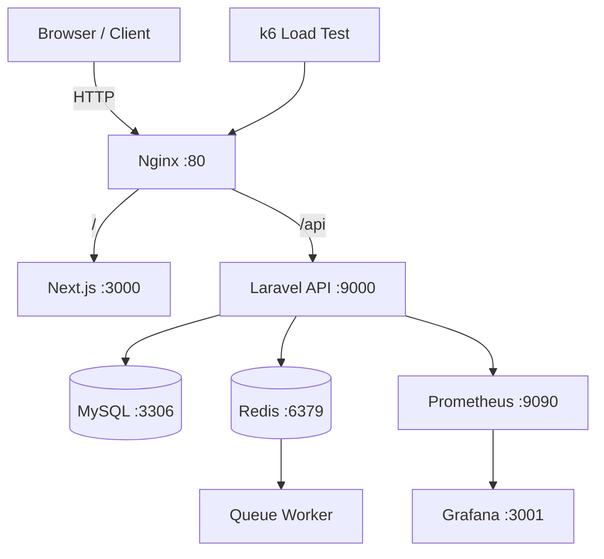

# Dockerized Laravel + Next.js DevOps Boilerplate

**Author:** Afash Gholami  
**Stack:** Laravel API, Next.js (TypeScript, Tailwind), Docker, Nginx, Redis, MySQL, Prometheus, Grafana, k6  
**Purpose:** Production-like DevOps boilerplate with full containerized architecture, monitoring, and load testing.

---

## 🧠 Project Overview

This repository is a **full DevOps-oriented boilerplate** that demonstrates how to run a modern web application using:

- **Next.js** as a frontend web application
- **Laravel** as a backend API
- **Nginx** as a reverse proxy
- **MySQL** for persistent storage
- **Redis** for cache & queue
- **Laravel Queue Worker** for async jobs
- **Prometheus + Grafana** for monitoring
- **k6** for load testing
- **Docker Compose** for orchestration

The architecture closely resembles a real-world production setup.

---

## 📁 Directory Structure

```text
.
├── backend
│   ├── api                 # Laravel API source code
│   ├── Dockerfile          # Laravel API Dockerfile
│   └── app.php             # Laravel bootstrap config
│
├── frontend
│   ├── app                 # Next.js application
│   └── Dockerfile          # Next.js Dockerfile
│
├── docker
│   ├── nginx               # Nginx reverse proxy
│   ├── php                 # PHP-FPM base image
│   └── front               # Frontend image (optional split)
│
├── docker-compose.yml      # Main orchestration file
│
├── monitoring
│   ├── prometheus          # Prometheus config
│   └── grafana             # Grafana dashboards & provisioning
│
├── load-test
│   └── k6.js               # Load testing script
│
├── scripts
│   └── backup-db.sh        # Database backup script
│
└── README.md
````

---

## 🔄 DevOps Request Lifecycle (Trace)

### 1. Client Request

A user sends a request from a browser or API client:

```
http://localhost/api/health
```

---

### 2. Nginx (Reverse Proxy)

* **Container:** `nginx`
* **Port:** `80`
* **Role:**

  * Entry point
  * Routing
  * Security boundary

Routing logic:

* `/` → Next.js frontend
* `/api` → Laravel API

---

### 3. Frontend – Next.js

* **Container:** `web`
* **Internal Port:** `3000`
* **Role:**

  * Server-side rendering
  * UI layer
  * API consumer

---

### 4. Backend – Laravel API

* **Container:** `api`
* **Internal Port:** `9000`
* **Role:**

  * Business logic
  * Authentication
  * API endpoints

Laravel request flow:

```
Route → Controller → Job / Service → DB / Redis
```

---

### 5. Database & Cache

#### MySQL

* **Container:** `db`
* **Port:** `3306`
* Used for persistent data

#### Redis

* **Container:** `redis`
* **Port:** `6379`
* Used for:

  * Cache
  * Queue
  * Sessions (optional)

---

### 6. Queue Worker (Async Processing)

* **Container:** `worker`
* **Command:**

```bash
php artisan queue:work redis
```

* Processes background jobs from Redis
* No exposed ports (internal service)

---

### 7. Monitoring & Observability

#### Prometheus

* **Container:** `prometheus`
* **Port:** `9090`
* Collects metrics from services

#### Grafana

* **Container:** `grafana`
* **Port:** `3001`
* Visualizes metrics from Prometheus

---

### 8. Load Testing (k6)

* **Location:** `load-test/k6.js`
* **Purpose:** Stress & performance testing
* **Execution example:**

```bash
docker run --rm -i grafana/k6 run - < load-test/k6.js
```

Load test flow:

```
k6 → nginx → api → db / redis
```

---

## 🔌 Services & Ports

| Service     | Container  | Port (Host) | Port (Internal) |
| ----------- | ---------- | ----------- | --------------- |
| Nginx       | nginx      | 80          | 80              |
| Frontend    | web        | 3000        | 3000            |
| Backend API | api        | —           | 9000            |
| MySQL       | db         | —           | 3306            |
| Redis       | redis      | —           | 6379            |
| Prometheus  | prometheus | 9090        | 9090            |
| Grafana     | grafana    | 3001        | 3000            |

---

## 📊 Architecture Diagram (Mermaid)



---

## 🐳 Docker Philosophy

* Each concern runs in its own container
* Internal communication via Docker network
* No direct DB/Redis exposure to host
* Easy to scale and production-ready

---

## 🎯 Current Status

✅ Frontend (Next.js)
✅ Backend API (Laravel)
✅ Reverse Proxy (Nginx)
✅ Queue & Worker
✅ Redis & MySQL
✅ Monitoring (Prometheus + Grafana)
✅ Load Testing (k6)


**Maintained & designed by Afash Gholami**
